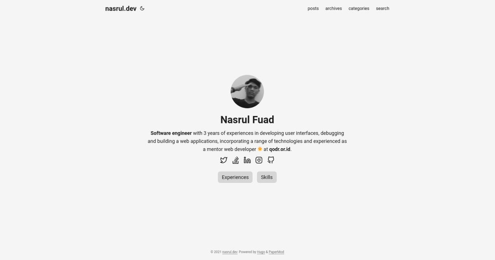

# Screenshot

<kbd></kbd>

# Requirement

- Hugo (>=v0.89.2)

# How To Start

- `hugo server`

# How To Build

- `hugo`
- Make sure `CNAME` file is exist in your `static` directory

# References

| Name           | Link                                 |
| -------------- | ------------------------------------ |
| patternpad     | https://patternpad.com/editor.html   |
| flow-lines     | https://msurguy.github.io/flow-lines |
| social preview | https://socialsharepreview.com/      |
